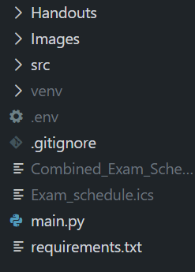
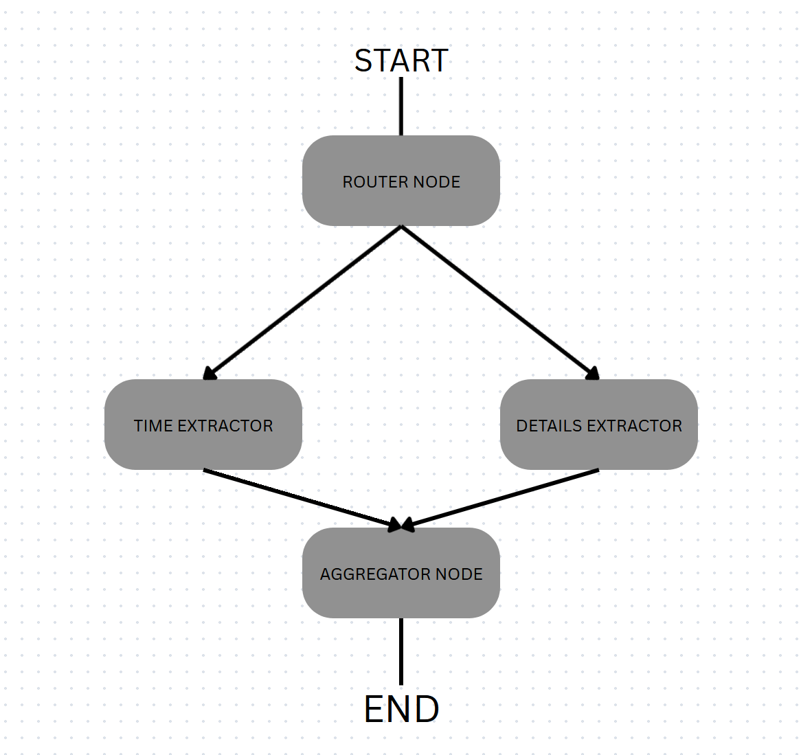
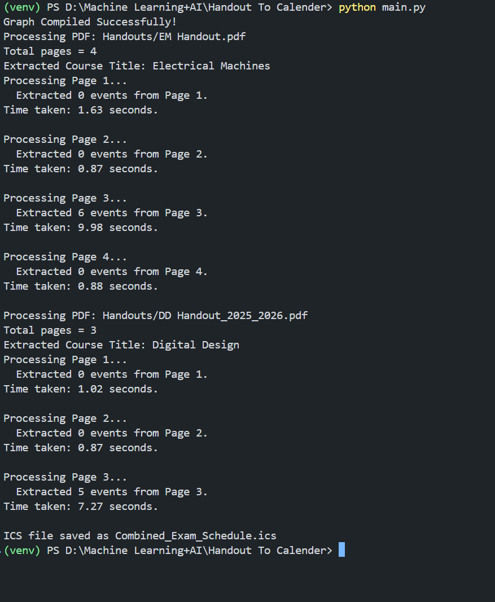

# Multi Agent for Handout to Calender
This repository contains a Gen AI project focused on an AI agent for automating the process of adding to Calender from University Course Handouts. 
The project leverages the LangGraph, OpenAI wrapper etc to create the bot.

## Technologies
Modules used:
1. LangGraph (for StateGraph)
2. langchain_openai (for OpenAI wrapper)
3. Pdfplumber, Datetime and Pydantic (BaseModel and Field)
4. _Gradio User Interface (SOON...)_

## Future ideas:
1. Gradio UI implementation
2. Hosting in Huggingface
3. Api cost management

## .env contents:
Steps:
1. The `.env` file must be placed in the root directory of this project like shown below

   <p align="center">
     
   </p>
2. The file contains three keywords:
- OPENAI_API_KEY
- OPENAI_API_BASE
- MODEL_NAME </br> </br>
NOTE that I have used **openrouter** and **meta-llama/llama-3.3-70b-instruct:free**

## NOTE (VERY IMPORTANT):
- Make sure to use virtual environment so that the modules used in this particular project doesn't affect other projects
1. TO CREATE THE ENVIRONMENT: </br>
`python3 -m venv venv` </br>
2. TO ACTIVATE THE ENVIRONMENT: </br>
Windows_POWERSHELL BASED TERMINAL = `venv\Scripts\activate.ps1` </br>
Windows_CMD BASED TERMINAL = `venv\Scripts\activate.bat` </br>
MAC = `source venv/bin/activate`

NOW,
ONCE ENVIRONMENT is ACTIVATED </br>
- RUN THE **REQUIREMENTS.TXT** FILE TO DOWNLOAD ALL THE REQUIRED MODULES using `pip install -r requirements.txt`

## Project Overview
- The core of the project is to automate the process of finding the exam dates, convert into ics file which can be used in adding them to calender. </br>
- The python file is included in this repository provides a detailed walkthrough of the model implementation. </br>
- The parallel form of langgraph takes multiple handout pdfs as input, and processes page by page and extract the contents of the page containing evaluation components and aggregating them via two nodes in parallel. </br>
- See this image structure below:

- The **Router Node** outputs a command to either "extract" the contents of this page or "skip" this page when looping page by page
- This is because the evaluation components of the course will be provided in any one of the pages and we don't need to waste compute power by checking for all the pages
- The **Time Extractor Node** extracts informations like Date of the exam, time of the exam, Afternoon or Forenoon
- The **Details Extractor Node** extracts informations like format (Open book or closed book), weightage (in terms of %)
- The **Aggregator Node** combines the result obtained in previous nodes by checking if the obtained outputs belong to the same event name (for e.g. data obtained belongs to event name ""Comprehensive Exam"")

## Procedure to building the model
### Data processing
Get the pdfs as input, extract the pdf contents using pdfplumber, save the contents in content.txt
```
import pdfplumber

raw_pages = []
with pdfplumber.open(pdf_file) as pdf:
    for i in range(len(pdf.pages)):
        page = pdf.pages[i]
        text = page.extract_text()
        raw_pages.append((i+1, text))
```
Code Credits = Thank you [https://github.com/jsvine/pdfplumber](https://github.com/jsvine/pdfplumber)

### Data extraction
- From the first page, always extract the **course title** and have it as global variable until the entire pdf is processed
- Each page contents enters **router node** and is either skipped: if no contents related to exams are present or extracted: the contents of evaluation components

### Data Collection
- The **time extractor** node extracts Date, time, and Forenoon or Afternoon
- The **details extractor** node extracts format, weightage

### Aggregating
To bring together all the collected data and aggregate in a particular json format
```
entry = {
    "Subject": full_title,
    "Event_Name": final_event_name,
    "Start_DateTime": final_start,
    "End_DateTime": final_end,
    "Format": fmt,
    "Weightage": wgt,
    "Raw_Time_String": t["time_raw"]
}
```

## Note: 
User can input multiple pdfs at once

## OUTPUT CLI


- We can clearly see that for page 3 of both Electrical Machines and Digital Design Courses took longer time clearly shows that those are the two pages with the contents of exams

## TO ADD TO GOOGLE CALENDER
- Import the Combined_Exam_Schedule.ics file into the calender and **BOOM** there you go all the events are now PRESENT
