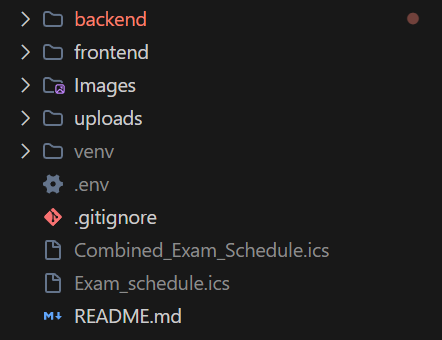
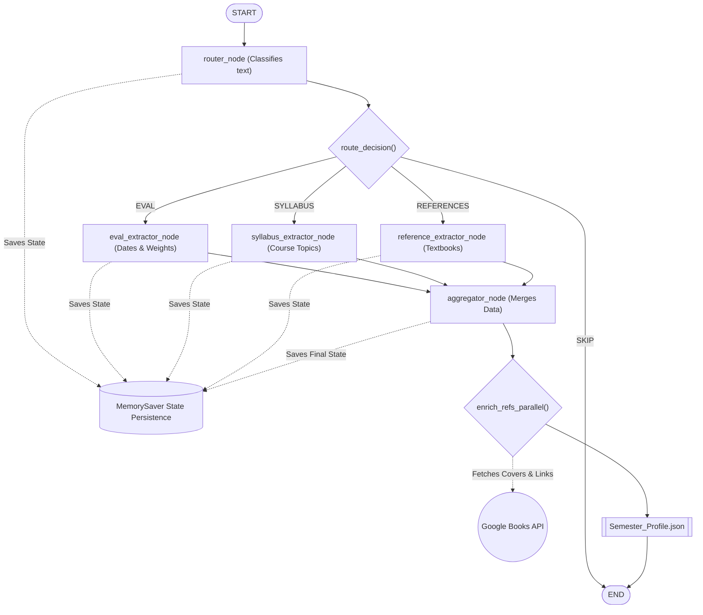
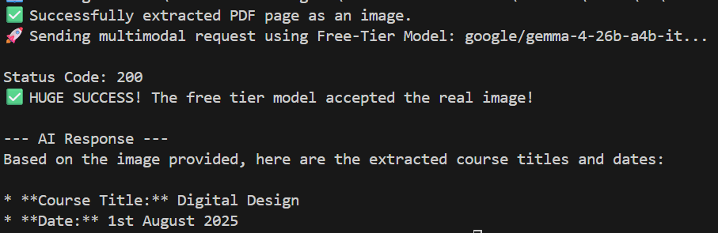
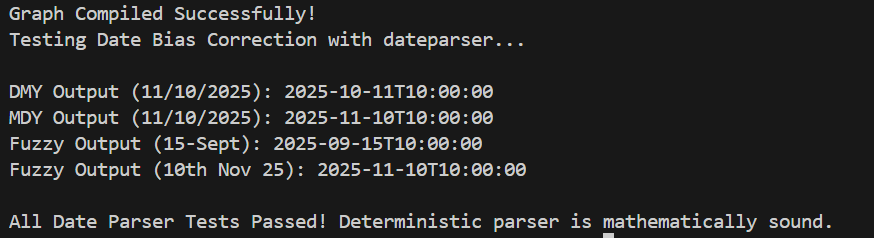
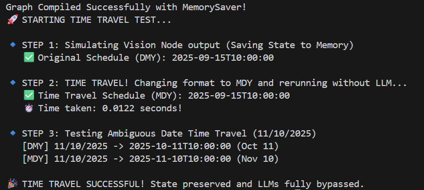
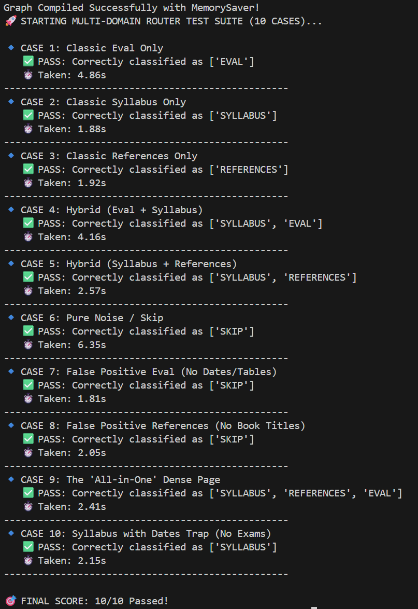
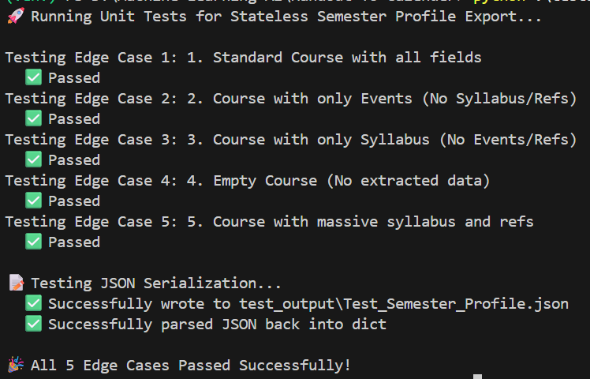
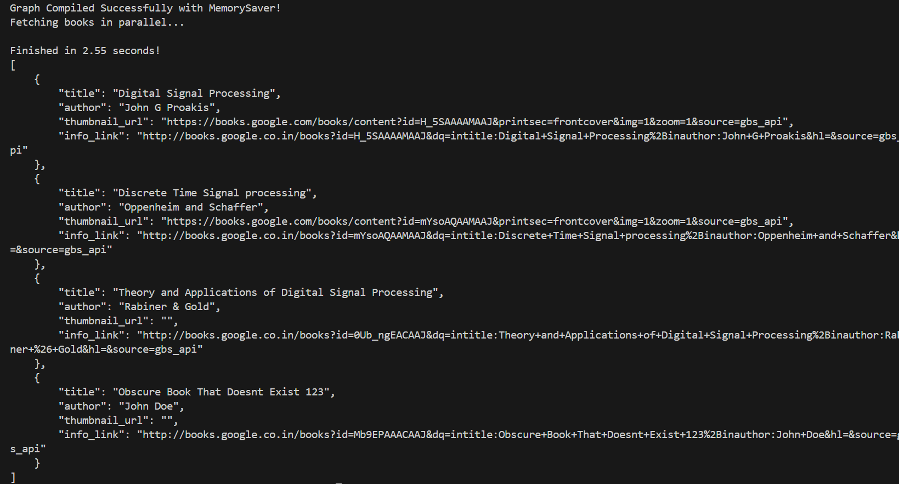

# Multi Agent for Handout to Calender
This repository contains a Gen AI project focused on an AI agent for automating the process of adding to Calender from University Course Handouts. 
The project leverages the LangGraph, OpenAI wrapper etc to create the bot.

## Technologies
Modules used:
1. LangGraph (for StateGraph)
2. langchain_openai (for OpenRouter wrapper)
3. langchain_google_genai (for Google Gemini native wrapper)
4. PyMuPDF (fitz) for PDF-to-Image rendering
5. Datetime and Pydantic (BaseModel and Field)
4. _Gradio User Interface (SOON...)_

## Folder Structure
```text
 Handout To Calender
 ┣ 📂 backend/
 ┃ ┣ 📂 Handouts/        # Test PDFs
 ┃ ┣ 📂 src/             # LangGraph Core Logic
 ┃ ┣ 📂 tests/           # Pytest API & Unit Tests
 ┃ ┣ 📜 api.py           # FastAPI Server Entrypoint
 ┃ ┣ 📜 main.py          # Legacy PDF Processor
 ┃ ┗ 📜 requirements.txt # Python Dependencies
 ┣ 📂 frontend/          # (Planned) Next.js Dashboard
 ┣ 📂 Images/            # Documentation Assets
 ┣ 📜 .env               # API Keys
 ┗ 📜 README.md
```

## Future ideas:
1. Gradio UI implementation
2. Hosting in Huggingface
3. Api cost management

## .env contents:
The `.env` file must be placed in the root directory of this project like shown below

   <p align="center">
     
   </p>


**Case 1.1: Free Tier ONLY**
Uses `gpt-oss-20b` (free via OpenRouter) for text routing and `gemini-2.5-flash` (via native Google AI Studio) for vision.
```env
OPENAI_API_KEY=your_key
OPENAI_API_BASE=https://openrouter.ai/api/v1
GOOGLE_API_KEY=your_key
GOOGLE_BOOK_API_KEY=your_key
ENVIRONMENT=development
```

**Case 1.2: Deployed (OpenRouter $5 Budget)**
Uses both text and vision models via OpenRouter to simplify API management.
```env
OPENAI_API_KEY=your_key
OPENAI_API_BASE=https://openrouter.ai/api/v1
GOOGLE_BOOK_API_KEY=your_key
ENVIRONMENT=production
```

**Case 1.3: AIGateway ONLY (Current Promo)**
Uses explicitly allowed free multimodal models (e.g., `google/gemma-4-26b-a4b-it`) via AIGateway.
```env
AIGATEWAY_API_KEY=your_key
GOOGLE_BOOK_API_KEY=your_key
ENVIRONMENT=development
```

## NOTE (VERY IMPORTANT):
- Make sure to use virtual environment so that the modules used in this particular project doesn't affect other projects
1. TO CREATE THE ENVIRONMENT: </br>
`python3 -m venv venv` </br>
2. TO ACTIVATE THE ENVIRONMENT: </br>
Windows_POWERSHELL BASED TERMINAL = `venv\Scripts\activate.ps1` </br>
Windows_CMD BASED TERMINAL = `venv\Scripts\activate.bat` </br>
MAC = `source venv/bin/activate`

NOW,
ONCE ENVIRONMENT is ACTIVATED </br>
- RUN THE **REQUIREMENTS.TXT** FILE TO DOWNLOAD ALL THE REQUIRED MODULES using `pip install -r requirements.txt`

## Project Overview
This project is a high-performance backend API built with **FastAPI** and **LangGraph**. It automates the extraction of schedules, syllabi, and references from University Course Handout PDFs.

- **FastAPI Layer:** Receives the uploaded PDF and securely handles rate-limiting (`20/day` via `slowapi`).
- **LangGraph Multi-Agent Pipeline:**
  - **Router Node (Text):** Quickly analyzes raw PDF text to classify the page, skipping irrelevant pages to save compute.
  - **Vision Extractor Nodes:** If the page contains an Evaluation Scheme, Syllabus, or References, a Multimodal Vision model extracts the complex tables directly from a Base64 image of the page.
  - **Aggregator Node:** Processes date logic mathematically via `dateparser` and structures the final unified JSON response.

### Planned Upgraded Architecture
This flowchart represents the finalized architecture that is actively being built. It introduces parallel vision extraction (for handling syllabus and admin data simultaneously) and a robust `MemorySaver` checkpointer for state persistence and fallback capabilities.


```mermaid
flowchart TD
    Checkpointer[(MemorySaver State Persistence)]
    GoogleBooks((Google Books API))
    JSONOut[[Semester_Profile.json]]

    START([START]) --> RouterNode["router_node (Classifies text)"]

    RouterNode --> RouteDecision{"route_decision()"}

    RouteDecision -- "EVAL" --> VisionEval["eval_extractor_node (Dates & Weights)"]
    RouteDecision -- "SYLLABUS" --> VisionSyllabus["syllabus_extractor_node (Course Topics)"]
    RouteDecision -- "REFERENCES" --> VisionReference["reference_extractor_node (Textbooks)"]
    RouteDecision -- "SKIP" --> END([END])

    VisionEval --> AggregatorNode["aggregator_node (Merges Data)"]
    VisionSyllabus --> AggregatorNode
    VisionReference --> AggregatorNode

    AggregatorNode --> PostProcess{"enrich_refs_parallel()"}
    PostProcess -. "Fetches Covers & Links" .-> GoogleBooks
    PostProcess --> JSONOut
    JSONOut --> END

    %% Checkpointer connections to show state saving
    RouterNode -. "Saves State" .-> Checkpointer
    VisionEval -. "Saves State" .-> Checkpointer
    VisionSyllabus -. "Saves State" .-> Checkpointer
    VisionReference -. "Saves State" .-> Checkpointer
    AggregatorNode -. "Saves Final State" .-> Checkpointer
```

## Testing & Validation
To ensure high accuracy in classifying document pages and routing them efficiently, we have implemented a dedicated test suite for the **Router Node**. By utilizing `PydanticOutputParser`, the pipeline enforces strict JSON formatting. The model successfully analyzes various edge cases—including syllabus pages, administrative info, and tricky false-positive grading policies—correctly assigning the required action.


### Vision Extractor Testing
We implemented a secondary dedicated test script (`test_vision.py`) specifically for the newly introduced **Vision Eval Extractor Node**. This ensures that the native Gemini Multimodal API perfectly transcribes complex tables containing spanned/merged cells and confusing date formats from the image without breaking existing text logic.


### AIGateway Multimodal Verification
To validate the **Zero-Cost Hybrid Architecture** for the current development phase, we rigorously tested `google/gemma-4-26b-a4b-it` via AIGateway. The script successfully extracted Base64 image payloads from PDFs, proving the model's multimodal capabilities on the free tier.



### Deterministic Date Parsing (Bias Correction)
To eliminate LLM date hallucination (e.g., American models confusing DD/MM formats), the extraction and formatting steps have been entirely decoupled. The Vision Node now only extracts the raw text snippet (e.g., `'11/10/25'`). The Aggregator Node then utilizes the deterministic Python `dateparser` library, anchored to the current academic year, to calculate the correct ISO timestamp mathematically based on a global user preference (`user_date_format: "DMY"` vs `"MDY"`).



### State Persistence and Time Travel (MemorySaver)
To optimize API costs and performance, the LangGraph pipeline is integrated with a `MemorySaver` checkpointer. Every processed PDF page is assigned a unique `thread_id`. By persisting the graph's internal state, we enable LangGraph "Time Travel." This powerful feature allows the application to jump back to the state immediately following the expensive Vision LLM extraction, modify a user preference (e.g., changing the global date format from "DMY" to "MDY"), and mathematically regenerate the exact ICS schedule in **~0.01 seconds**—bypassing LLM API calls entirely.



### Parallel Multi-Domain Routing (Fan-Out Architecture)
To support a rich interactive dashboard, the system now features **Multi-Domain Extraction**. Instead of just extracting exam dates, the LangGraph Text Router categorizes each PDF page into multiple domains simultaneously (`EVAL`, `SYLLABUS`, `REFERENCES`). The workflow then uses LangGraph's dynamic list-based routing to seamlessly trigger parallel Vision LLM nodes. This "fan-out" architecture allows us to rapidly extract Course Outlines (for Bunk Limit calculation) and Textbook titles (for Google Books API linking) all at the exact same time!



### Stateless Semester Profile Export (Zero-Database Architecture)
To maintain a strict privacy-first, zero-database backend, the Aggregator now compiles all the extracted data (Evaluation Events, Syllabus Topics with lecture hours, and Reference Books) across all PDFs into a single, structured `Semester_Profile.json` file inside the `output/` directory. This acts as a portable "Stateless Profile". The user can simply upload this tiny JSON file on their next visit to instantly restore their full dashboard and bunk calculators without needing any expensive LLM API calls.



### Parallel Metadata Enrichment (Google Books API)
To provide a rich academic experience, the pipeline automatically fetches high-resolution book covers and purchase links for all extracted reference materials. To bypass sequential bottlenecks, this is handled via a `ThreadPoolExecutor` that queries the **Google Books API** concurrently for all books. To prevent impacting the Gemini Vision quota, this feature is completely isolated, using a dedicated `GOOGLE_BOOK_API_KEY` authenticated via Google Cloud Console, effortlessly bypassing the standard unauthenticated IP limit for high-volume stateless usage.



## Procedure to building the model
### Data processing
Get the pdfs as input, extract both the pdf text and render the page as an image using PyMuPDF (fitz), returning them simultaneously for the Graph.
```python
import fitz # PyMuPDF
import base64

raw_pages = []
doc = fitz.open(pdf_file)
for i in range(len(doc)):
    page = doc[i]
    text = page.get_text()
    
    pix = page.get_pixmap(dpi=150)
    img_bytes = pix.tobytes("png")
    b64_image = base64.b64encode(img_bytes).decode("utf-8")
    
    raw_pages.append((i+1, text, b64_image))
```
Code Credits = Thank you [https://github.com/jsvine/pdfplumber](https://github.com/jsvine/pdfplumber)

### Data extraction
- From the first page, always extract the **course title** and have it as global variable until the entire pdf is processed
- Each page contents enters **router node** and is either skipped: if no contents related to exams are present or extracted: the contents of evaluation components

### Data Collection
- The **Vision Eval Extractor Node** processes the image using `gemini-2.5-flash` to extract Event Name, Date, Time, Format, and Weightage in a single cohesive pass. This eliminates misalignments from text-based parsers.

### Aggregating
To bring together all the collected data and aggregate in a particular json format
```
entry = {
    "Subject": full_title,
    "Event_Name": final_event_name,
    "Start_DateTime": final_start,
    "End_DateTime": final_end,
    "Format": fmt,
    "Weightage": wgt,
    "Raw_Time_String": t["time_raw"]
}
```

## Note: 
User can input multiple pdfs at once

## OUTPUT CLI


- We can clearly see that for page 3 of both Electrical Machines and Digital Design Courses took longer time clearly shows that those are the two pages with the contents of exams

## TO ADD TO GOOGLE CALENDER
- Import the Combined_Exam_Schedule.ics file into the calender and **BOOM** there you go all the events are now PRESENT

---

## 🗄️ Archive: Old Architecture (Scrapped)
*Note: This was the original V1 architecture that used brittle, parallel text-extraction LLMs. It has officially been deprecated and replaced by the native Multimodal Vision Graph shown above.*


### Why it was scrapped:
1. **Brittle Aggregation:** Splitting the "Time" and "Details" into two completely separate LLM calls required fuzzy string matching in the Aggregator to stitch them back together. If one node called an event "Mid-Sem" and the other called it "Mid Semester", the merge would fail entirely.
2. **Tabular Hallucinations:** Text-based parsers like `pdfplumber` destroy the visual layout of complex tables (merged cells, wrapped text, and column alignments). Feeding this scrambled text to an LLM caused massive hallucinations when trying to figure out which weightage belonged to which assignment. Switching to the Vision Graph solved this instantly.
