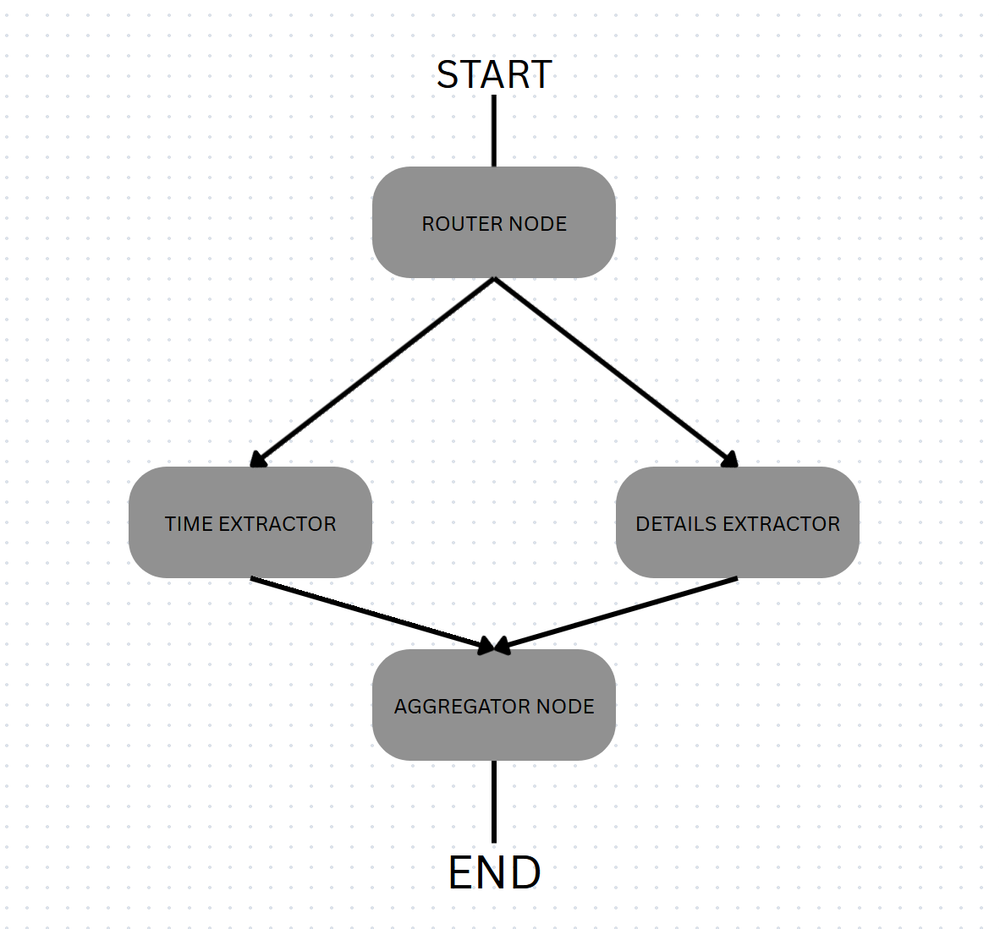
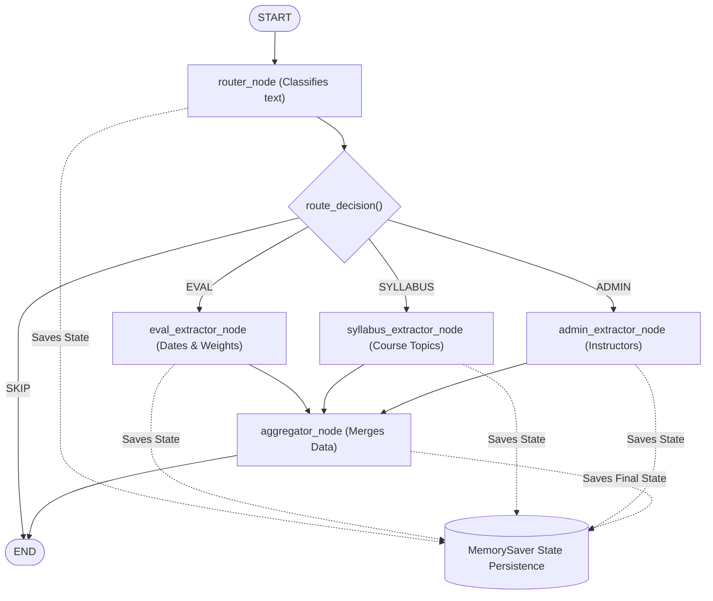
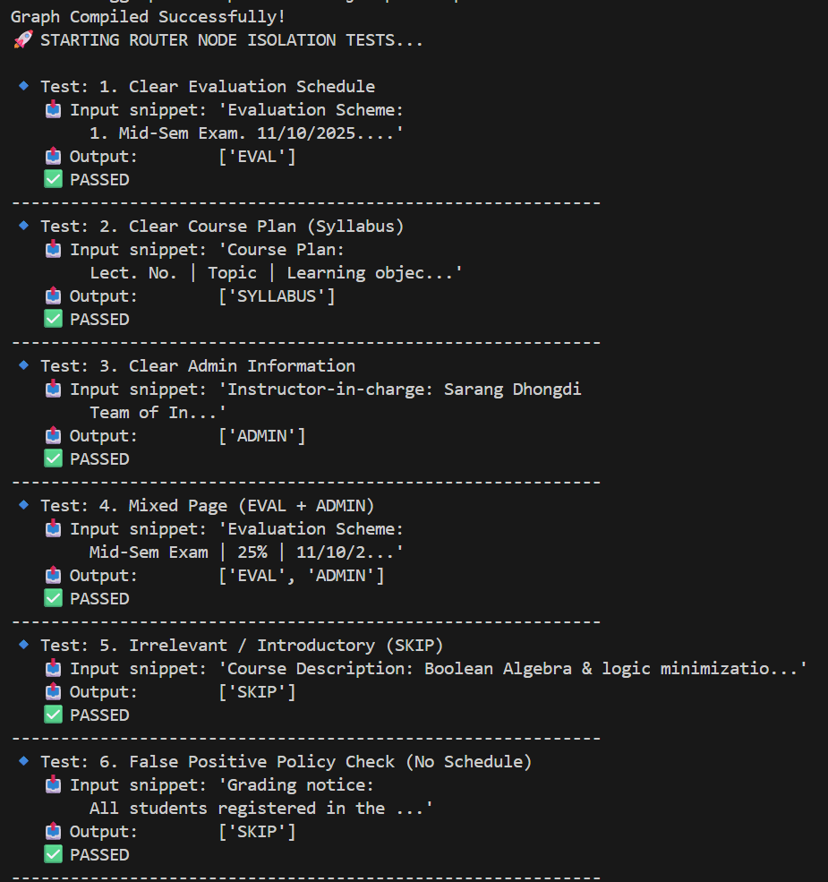
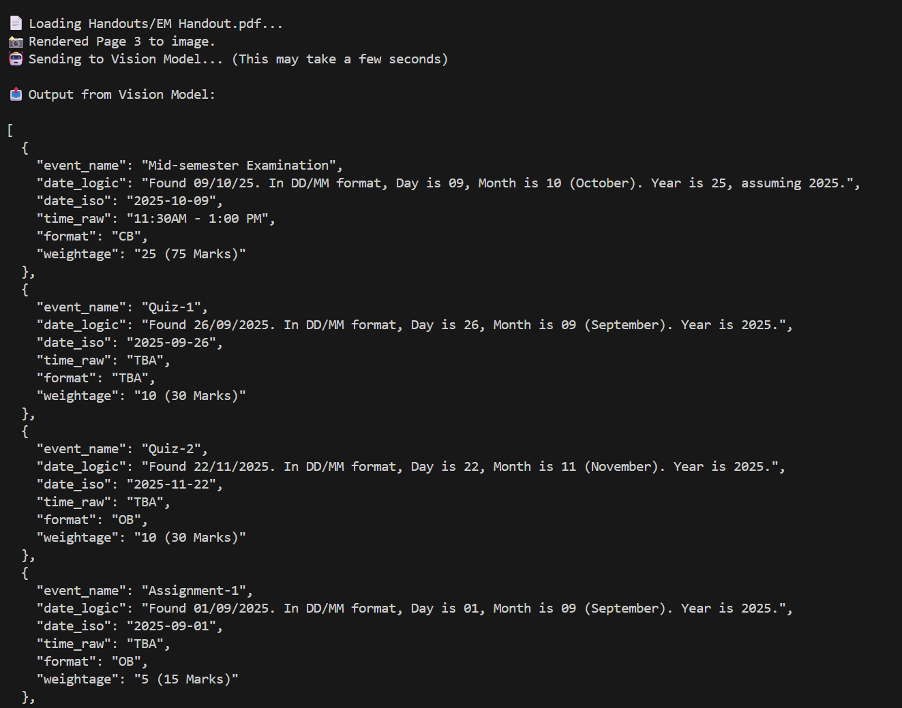
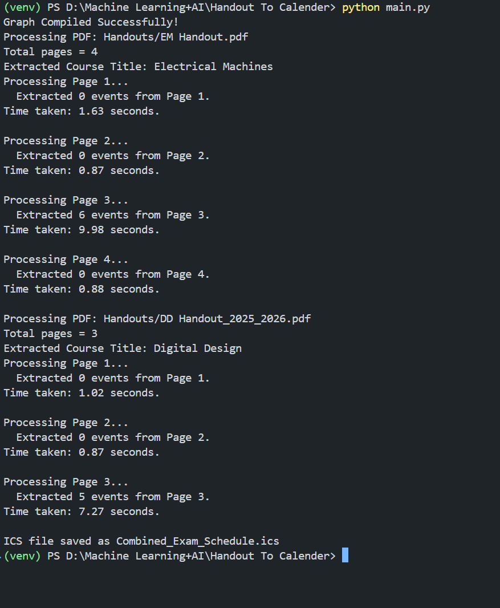

# Multi Agent for Handout to Calender
This repository contains a Gen AI project focused on an AI agent for automating the process of adding to Calender from University Course Handouts. 
The project leverages the LangGraph, OpenAI wrapper etc to create the bot.

## Technologies
Modules used:
1. LangGraph (for StateGraph)
2. langchain_openai (for OpenRouter wrapper)
3. langchain_google_genai (for Google Gemini native wrapper)
4. PyMuPDF (fitz) for PDF-to-Image rendering
5. Datetime and Pydantic (BaseModel and Field)
4. _Gradio User Interface (SOON...)_

## Future ideas:
1. Gradio UI implementation
2. Hosting in Huggingface
3. Api cost management

## .env contents:
Steps:
1. The `.env` file must be placed in the root directory of this project like shown below

   <p align="center">
     
   </p>
2. The file contains four keywords required for the dual-architecture setup:
- OPENAI_API_KEY (Your OpenRouter Key)
- OPENAI_API_BASE (Set to https://openrouter.ai/api/v1)
- MODEL_NAME (Your text router model) 
- GOOGLE_API_KEY (Your native Google AI Studio Key) </br> </br>
NOTE that I have used **openrouter** with **openai/gpt-oss-20b:free** for routing, and Google's native **gemini-2.5-flash** for multimodal vision extraction.

## NOTE (VERY IMPORTANT):
- Make sure to use virtual environment so that the modules used in this particular project doesn't affect other projects
1. TO CREATE THE ENVIRONMENT: </br>
`python3 -m venv venv` </br>
2. TO ACTIVATE THE ENVIRONMENT: </br>
Windows_POWERSHELL BASED TERMINAL = `venv\Scripts\activate.ps1` </br>
Windows_CMD BASED TERMINAL = `venv\Scripts\activate.bat` </br>
MAC = `source venv/bin/activate`

NOW,
ONCE ENVIRONMENT is ACTIVATED </br>
- RUN THE **REQUIREMENTS.TXT** FILE TO DOWNLOAD ALL THE REQUIRED MODULES using `pip install -r requirements.txt`

## Project Overview
- The core of the project is to automate the process of finding the exam dates, convert into ics file which can be used in adding them to calender. </br>
- The python file is included in this repository provides a detailed walkthrough of the model implementation. </br>
- The multimodal graph takes multiple handout pdfs as input, processing them page by page. It simultaneously extracts the raw text and renders the page as a Base64 Image. </br>
- See this image structure below:

- The **Router Node** (Text-based) analyzes the page text and outputs a command to either "extract" the contents of this page or "skip" it.
- This is because the evaluation components of the course will be provided in any one of the pages and we don't need to waste compute power by checking for all the pages.
- The **Vision Eval Extractor Node** (Multimodal-based) takes over if an evaluation scheme is detected. It takes the *Image* of the page and natively extracts complex tables, fetching the Date, Time, Format (Open/Closed Book), and Weightage simultaneously.
- The **Aggregator Node** combines the perfect JSON results obtained from the vision model and processes complex date logic into ISO formats before merging them.

### Planned Upgraded Architecture
This flowchart represents the finalized architecture that is actively being built. It introduces parallel vision extraction (for handling syllabus and admin data simultaneously) and a robust `MemorySaver` checkpointer for state persistence and fallback capabilities.


```mermaid
flowchart TD
    Checkpointer[(MemorySaver State Persistence)]

    START([START]) --> RouterNode["router_node (Classifies text)"]

    RouterNode --> RouteDecision{"route_decision()"}

    RouteDecision -- "EVAL" --> VisionEval["eval_extractor_node (Dates & Weights)"]
    RouteDecision -- "SYLLABUS" --> VisionSyllabus["syllabus_extractor_node (Course Topics)"]
    RouteDecision -- "ADMIN" --> VisionAdmin["admin_extractor_node (Instructors)"]
    RouteDecision -- "SKIP" --> END([END])

    VisionEval --> AggregatorNode["aggregator_node (Merges Data)"]
    VisionSyllabus --> AggregatorNode
    VisionAdmin --> AggregatorNode

    AggregatorNode --> END

    %% Checkpointer connections to show state saving
    RouterNode -. "Saves State" .-> Checkpointer
    VisionEval -. "Saves State" .-> Checkpointer
    VisionSyllabus -. "Saves State" .-> Checkpointer
    VisionAdmin -. "Saves State" .-> Checkpointer
    AggregatorNode -. "Saves Final State" .-> Checkpointer
```

## Testing & Validation
To ensure high accuracy in classifying document pages and routing them efficiently, we have implemented a dedicated test suite for the **Router Node**. By utilizing `PydanticOutputParser`, the pipeline enforces strict JSON formatting. The model successfully analyzes various edge cases—including syllabus pages, administrative info, and tricky false-positive grading policies—correctly assigning the required action.



### Vision Extractor Testing
We implemented a secondary dedicated test script (`test_vision.py`) specifically for the newly introduced **Vision Eval Extractor Node**. This ensures that the native Gemini Multimodal API perfectly transcribes complex tables containing spanned/merged cells and confusing date formats from the image without breaking existing text logic.

## Procedure to building the model
### Data processing
Get the pdfs as input, extract both the pdf text and render the page as an image using PyMuPDF (fitz), returning them simultaneously for the Graph.
```python
import fitz # PyMuPDF
import base64

raw_pages = []
doc = fitz.open(pdf_file)
for i in range(len(doc)):
    page = doc[i]
    text = page.get_text()
    
    pix = page.get_pixmap(dpi=150)
    img_bytes = pix.tobytes("png")
    b64_image = base64.b64encode(img_bytes).decode("utf-8")
    
    raw_pages.append((i+1, text, b64_image))
```
Code Credits = Thank you [https://github.com/jsvine/pdfplumber](https://github.com/jsvine/pdfplumber)

### Data extraction
- From the first page, always extract the **course title** and have it as global variable until the entire pdf is processed
- Each page contents enters **router node** and is either skipped: if no contents related to exams are present or extracted: the contents of evaluation components

### Data Collection
- The **Vision Eval Extractor Node** processes the image using `gemini-2.5-flash` to extract Event Name, Date, Time, Format, and Weightage in a single cohesive pass. This eliminates misalignments from text-based parsers.

### Aggregating
To bring together all the collected data and aggregate in a particular json format
```
entry = {
    "Subject": full_title,
    "Event_Name": final_event_name,
    "Start_DateTime": final_start,
    "End_DateTime": final_end,
    "Format": fmt,
    "Weightage": wgt,
    "Raw_Time_String": t["time_raw"]
}
```

## Note: 
User can input multiple pdfs at once

## OUTPUT CLI


- We can clearly see that for page 3 of both Electrical Machines and Digital Design Courses took longer time clearly shows that those are the two pages with the contents of exams

## TO ADD TO GOOGLE CALENDER
- Import the Combined_Exam_Schedule.ics file into the calender and **BOOM** there you go all the events are now PRESENT
